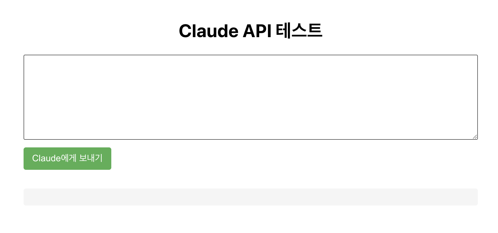

# ClaudeAPI-BackendTest



이 프로젝트는 Anthropic의 Claude API를 활용한 웹 애플리케이션으로, React 프론트엔드와 Express 백엔드로 구성되어 있습니다.

## 프로젝트 개요

사용자가 프롬프트를 입력하면 Claude API를 통해 AI 응답을 생성하고 표시하는 간단한 웹 인터페이스를 제공합니다.

## 프로젝트 구조

```
ClaudeAPI-BackendTest/
├── client/        # React 프론트엔드
└── server/        # Express 백엔드
```

## 주요 기능

- 사용자 텍스트 입력 인터페이스
- Claude API와의 통신을 위한 백엔드 서버
- AI 응답 표시 및 오류 처리

## 기술 스택

### 프론트엔드
- React.js
- Axios (HTTP 요청)

### 백엔드
- Node.js
- Express.js
- Axios (HTTP 요청)
- dotenv (환경변수 관리)

## 시작하기

### 필수 요구사항
- Node.js (최신 LTS 버전 권장)
- Anthropic Claude API 키

### 백엔드 설정

1. server 디렉토리로 이동:
```bash
cd server
```

2. 의존성 패키지 설치:
```bash
npm install
```

3. `.env` 파일 설정:
```
ANTHROPIC_API_KEY=your_api_key_here
PORT=5001
```

4. 서버 시작:
```bash
node index.js
```

서버는 기본적으로 5001 포트에서 실행됩니다.

### 프론트엔드 설정

1. client 디렉토리로 이동:
```bash
cd client
```

2. 의존성 패키지 설치:
```bash
npm install
```

3. 개발 서버 시작:
```bash
npm start
```

프론트엔드는 기본적으로 3000 포트에서 실행됩니다.
브라우저에서 http://localhost:3000 으로 접속하여 앱을 사용할 수 있습니다.

## 상세 정보

각 폴더에는 자세한 설명이 포함된 README 파일이 있습니다:

- [클라이언트 문서](./client/README.md)
- [서버 문서](./server/README.md) 